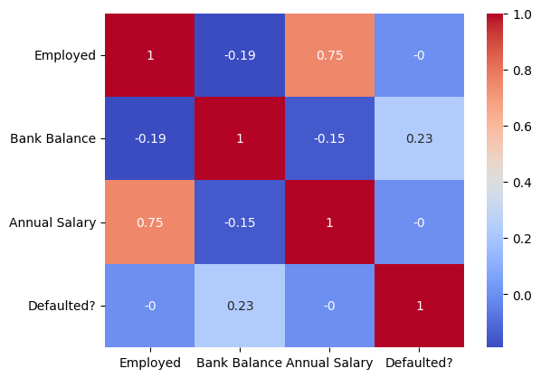

# Laporan Proyek Machine Learning - PUTRA ADE NIRADA
**Nama:** PUTRA ADE NIRADA

**ID Dicoding:** putraade

## Domain Proyek: Prediksi Gagal Bayar Pinjaman

Sektor keuangan sangat bergantung pada pengelolaan **risiko kredit**, yaitu potensi kerugian akibat **gagal bayar (default)** pinjaman. Gagal bayar dapat menyebabkan kerugian finansial signifikan bagi lembaga keuangan, mulai dari penurunan profitabilitas hingga krisis likuiditas[1].

Masalah ini penting untuk diselesaikan karena metode penilaian risiko tradisional kurang akurat dan efisien di tengah kompleksitas produk keuangan dan volume data yang besar. Tingginya angka gagal bayar tidak hanya merugikan lembaga keuangan tetapi juga menghambat pertumbuhan ekonomi. Dengan memprediksi gagal bayar, institusi dapat:

* **Meningkatkan Efisiensi Operasional:** Keputusan pinjaman lebih cepat dan konsisten.
* **Memitigasi Risiko:** Mengidentifikasi peminjam berisiko tinggi sejak awal untuk mengambil tindakan pencegahan.
* **Meningkatkan Profitabilitas:** Menekan angka gagal bayar untuk menjaga kualitas portofolio pinjaman.
* **Memenuhi Kepatuhan Regulasi:** Membantu memenuhi standar manajemen risiko yang ketat.

### Referensi

[1] V. Dalmen, "Pengaruh Kredit Macet Terhadap Kestabilan Keuangan Perbankan di Indonesia," Fakultas Hukum, Universitas Muhammadiyah Sumatera Barat, Indonesia, 2025.

---

## Business Understanding

### Problem Statements

Proyek ini bertujuan untuk mengatasi tantangan utama yang dihadapi oleh lembaga keuangan dalam hal **prediksi gagal bayar pinjaman**, dengan fokus pada penggunaan metode yang sederhana namun tetap andal.

1. **Pernyataan Masalah 1**
   Lembaga keuangan mengalami risiko kerugian finansial akibat nasabah yang gagal bayar, namun sering kali tidak memiliki sistem prediksi yang efektif untuk mengidentifikasi risiko tersebut secara akurat sejak awal.

2. **Pernyataan Masalah 2**
   Banyak proses evaluasi kelayakan kredit masih dilakukan secara manual atau menggunakan pendekatan sederhana yang tidak mampu menangani data dalam skala besar dan kompleks, serta berpotensi bias.

3. **Pernyataan Masalah 3**
   Dibutuhkan solusi prediksi berbasis machine learning yang cepat, praktis, dan tidak bergantung pada teknik kompleks seperti hyperparameter tuning, agar mudah diimplementasikan oleh tim teknis tanpa keahlian ML mendalam.

---

### Goals

1. **Jawaban Pernyataan Masalah 1**
   Mengembangkan sistem klasifikasi yang mampu mengenali pola-pola risiko gagal bayar dari data historis nasabah, dengan tetap mempertahankan akurasi tinggi.

2. **Jawaban Pernyataan Masalah 2**
   Mengotomatisasi proses evaluasi pinjaman melalui model machine learning berbasis data, yang dapat meningkatkan efisiensi dan mengurangi subjektivitas dalam pengambilan keputusan.

3. **Jawaban Pernyataan Masalah 3**
   Membangun model prediktif menggunakan **algoritma klasifikasi populer** seperti KNN, Random Forest, dan Gradient Boosting dengan konfigurasi default, sehingga model dapat langsung digunakan tanpa memerlukan proses tuning yang rumit.

---

### Solution Statements

1. **Solution Statement 1**
   Menggunakan tiga algoritma klasifikasi yaitu **K-Nearest Neighbors (KNN)**, **Random Forest Classifier**, dan **Gradient Boosting Classifier** tanpa hyperparameter tuning untuk membangun model prediksi gagal bayar pinjaman. Ketiga model akan dilatih menggunakan konfigurasi default agar proses tetap sederhana dan langsung dapat diimplementasikan.

2. **Solution Statement 2**
   Melakukan **feature selection sederhana** berdasarkan korelasi dan pengetahuan domain untuk memilih fitur yang paling relevan. Data akan dibersihkan dan distandardisasi agar sesuai dengan kebutuhan algoritma yang digunakan.

3. **Solution Statement 3**
   Evaluasi performa model dilakukan dengan metrik yang komprehensif, yaitu **accuracy\_score**, **precision\_score**, **recall\_score**, **f1\_score**, serta analisis mendalam menggunakan **confusion\_matrix**. Model terbaik akan dipilih berdasarkan nilai **F1-Score** tertinggi pada data uji, dengan target minimum F1-Score sebesar **87%**.
   
---

## Data Understanding

Pada tahap ini, dilakukan eksplorasi awal terhadap dataset *Default\_Fin.csv* untuk memahami karakteristik data yang digunakan dalam proses analisis. Dataset ini terdiri dari informasi finansial individu yang dapat digunakan untuk memprediksi apakah seseorang berpotensi mengalami gagal bayar (*default*).
Link Dataset : (https://www.kaggle.com/datasets/kmldas/loan-default-prediction).

### Pemuatan Data dan Informasi Dasar

Dataset dimuat menggunakan pustaka `pandas`. Berdasarkan hasil `df.info()`, dataset terdiri dari **10.000 baris dan 5 kolom**, tanpa adanya nilai kosong (*missing values*) pada seluruh kolom.

```python
# Output ringkasan
df.shape  -> (10000, 5)
df.isnull().sum()  -> semua bernilai 0
```

### Deskripsi Variabel

Berikut adalah penjelasan singkat mengenai tiap kolom dalam dataset:

| Nama Variabel   | Tipe Data | Deskripsi                                                                          |
| --------------- | --------- | ---------------------------------------------------------------------------------- |
| `Index`         | `int64`   | Penomoran baris atau identifikasi unik data (tidak memiliki nilai prediktif)       |
| `Employed`      | `int64`   | Status pekerjaan (1 = bekerja, 0 = tidak bekerja)                                  |
| `Bank Balance`  | `float64` | Saldo tabungan dalam satuan mata uang                                              |
| `Annual Salary` | `float64` | Pendapatan tahunan individu                                                        |
| `Defaulted?`    | `int64`   | Label target, menunjukkan apakah individu mengalami gagal bayar (1) atau tidak (0) |

### Statistik Deskriptif

Berikut ini adalah ringkasan statistik deskriptif untuk kolom numerik:
|index|Index|Employed|Bank Balance|Annual Salary|Defaulted?|
|---|---|---|---|---|---|
|count|10000\.0|10000\.0|10000\.0|10000\.0|10000\.0|
|mean|5000\.5|0\.7056|10024\.498524|402203\.782224|0\.0333|
|std|2886\.8956799071675|0\.45579536520408753|5804\.579485551093|160039\.6749881727|0\.17942778333622056|
|min|1\.0|0\.0|0\.0|9263\.64|0\.0|
|25%|2500\.75|0\.0|5780\.79|256085\.52|0\.0|
|50%|5000\.5|1\.0|9883\.619999999999|414631\.74|0\.0|
|75%|7500\.25|1\.0|13995\.66|525692\.76|0\.0|
|max|10000\.0|1\.0|31851\.84|882650\.76|1\.0|

* Rata-rata saldo bank (`Bank Balance`) adalah sekitar **10.024**, dengan standar deviasi **5.804**.
* Rata-rata gaji tahunan (`Annual Salary`) adalah **402.203**, dengan penyebaran data yang cukup besar (standar deviasi **160.039**).
* Hanya sekitar **3.33%** individu yang mengalami gagal bayar (`Defaulted?` = 1), menunjukkan data yang cukup imbalanced.
* Kolom `Employed` memiliki nilai 1 untuk sekitar **70.56%** data, sisanya adalah individu yang tidak bekerja.

### Analisis Outlier

Untuk mengidentifikasi outlier, digunakan visualisasi boxplot dan perhitungan IQR pada fitur numerik seperti `Bank Balance` dan `Annual Salary`. Outlier awal terlihat pada:

* `Bank Balance`: beberapa individu memiliki saldo 0, namun terdapat juga nilai yang sangat tinggi.
* `Annual Salary`: terlihat distribusi gaji yang sangat lebar, yang memungkinkan adanya nilai ekstrem.


### Visualisai Distribusi Data

Visualisasi seperti histogram memungkinkan kita melihat bentuk, pola, dan sebaran data secara intuitif (misalnya, apakah data terdistribusi normal, miring, atau memiliki beberapa puncak). Ini membantu mengidentifikasi karakteristik dasar data yang tidak terlihat dari angka saja.
* Pada kolom Employed mayoritas individu dalam dataset memiliki pekerjaan.
* Pada kolom bank balance menunjukkan bahwa sebagian besar individu dalam dataset memiliki saldo bank yang sangat rendah, bahkan mendekati nol. Ini bisa menjadi indikasi bahwa banyak orang memiliki sedikit atau tidak ada tabungan.
* Pada Kolom Annual Salary menunjukkan bahwa ada dua kelompok atau sub-populasi yang berbeda dalam data gaji tahunan.
* Pada kolom Defaulted? Ada sejumlah besar data point yang terkonsentrasi pada nilai 0. Ini berarti mayoritas besar individu dalam dataset tidak melakukan default (gagal bayar). Tingginya bar di sekitar 0 menunjukkan jumlah (count) yang sangat tinggi.


### Coorelation Matrix

Fungsi utama corelation matrix adalah untuk secara cepat dan mudah mengidentifikasi kekuatan dan arah hubungan linier antara setiap pasang variabel dalam dataset.



Matriks ini menyoroti hubungan linier antar variabel. Yang paling menonjol adalah korelasi positif yang kuat antara "Employed" dan "Annual Salary". Korelasi lainnya relatif lemah atau bahkan mendekati nol, menunjukkan bahwa hubungan linier antara variabel-variabel tersebut tidak terlalu kuat.

### Insight Awal dari Data

* **Insight 1:** Mayoritas individu dalam dataset memiliki pekerjaan, dan kemungkinan gagal bayar lebih rendah pada individu yang bekerja.
* **Insight 2:** Saldo bank dan gaji tahunan tampaknya memiliki peran penting dalam menentukan kemungkinan gagal bayar.
* **Insight 3:** Dataset sangat tidak seimbang dari sisi target (`Defaulted?`), sehingga perlu penanganan khusus seperti resampling atau pemilihan metrik evaluasi yang tepat.

---

## Data Preparation

Pada tahap ini, dilakukan serangkaian proses untuk menyiapkan data sebelum masuk ke tahap pemodelan machine learning. Langkah-langkah yang dilakukan adalah sebagai berikut:
### 1. Penghapusan Fitur yang Tidak Relevan

Kolom `Index` merupakan identifier unik yang tidak memiliki pengaruh terhadap prediksi dan oleh karena itu dihapus dari dataset:

```python
df_cleaned = df.drop(columns=['Index'])
```
### 2. Penanganan Outlier

Outlier dapat berdampak negatif terhadap performa model prediktif. Oleh karena itu, dalam proyek ini akan dilakukan penanganan outlier menggunakan metode IQR (*Interquartile Range*), terutama untuk fitur `Bank Balance` dan `Annual Salary`. Titik data di luar rentang Q1 - 1.5*IQR dan Q3 + 1.5*IQR akan dianggap sebagai outlier dan dihapus dari dataset.


### 3. Pembagian Data (Train-Test Split)

Langkah pertama adalah membagi data ke dalam dua subset, yaitu data latih (training set) dan data uji (test set), dengan proporsi 80:20. Pembagian ini penting untuk memastikan bahwa model dapat diuji secara adil terhadap data yang belum pernah dilihat sebelumnya.

**Distribusi kelas setelah pembagian data:**

* **Training Set:**

  * Kelas 0 (tidak gagal bayar): 7642
  * Kelas 1 (gagal bayar): 158
  * Proporsi gagal bayar: **2.03%**

* **Test Set:**

  * Kelas 0 (tidak gagal bayar): 1912
  * Kelas 1 (gagal bayar): 39
  * Proporsi gagal bayar: **2.00%**

Distribusi ini menunjukkan bahwa dataset sangat tidak seimbang (imbalanced), yang dapat menyebabkan model bias terhadap kelas mayoritas (tidak gagal bayar).

### 4. Penyeimbangan Data dengan SMOTEEN

Untuk menangani masalah ketidakseimbangan kelas pada data latih, digunakan teknik **SMOTEEN** (Synthetic Minority Oversampling Technique + Edited Nearest Neighbors). Teknik ini menggabungkan metode oversampling dan undersampling:

* **SMOTE** menambahkan data sintetis untuk kelas minoritas (gagal bayar).
* **ENN** menghapus data dari kelas mayoritas yang "bermasalah" (misalnya terlalu dekat dengan kelas minoritas).

Tujuan penggunaan SMOTEEN adalah untuk:

* Meningkatkan jumlah sampel pada kelas minoritas,
* Mengurangi noise dari kelas mayoritas yang berpotensi membingungkan model,
* Meningkatkan kemampuan model dalam mengenali pola dari kelas minoritas.

> **Catatan penting:** Resampling **hanya dilakukan pada data latih**, bukan pada data uji. Hal ini untuk menghindari kebocoran data (data leakage) yang dapat menyebabkan hasil evaluasi model menjadi tidak valid.

### 5. Feature Scaling dengan StandardScaler

Setelah proses resampling, dilakukan **feature scaling** menggunakan `StandardScaler`. Teknik ini mentransformasikan setiap fitur numerik agar memiliki distribusi dengan **rata-rata 0 dan standar deviasi 1**. Alasan utama melakukan scaling adalah:

* Beberapa algoritma machine learning, seperti KNN, SVM, dan Logistic Regression, sangat sensitif terhadap skala data.
* Feature scaling membantu proses pelatihan model menjadi lebih stabil dan konvergen lebih cepat.

Proses scaling dilakukan **setelah** SMOTEEN untuk memastikan bahwa data sintetis juga berada dalam skala yang sesuai.

## Modeling

Pada tahap ini, dilakukan pemodelan machine learning untuk menyelesaikan permasalahan **klasifikasi gagal bayar pinjaman**. Tiga algoritma digunakan dan dibandingkan kinerjanya, yaitu:

1. **K-Nearest Neighbors (KNN)**
2. **Random Forest Classifier**
3. **Gradient Boosting Classifier**

Model dibuat menggunakan kode berikut:

```python
models = {
    "KNN": KNeighborsClassifier(n_neighbors=15),
    "Random Forest": RandomForestClassifier(random_state=42),
    "Gradient Boosting": GradientBoostingClassifier(random_state=42),
}
```

### **1. K-Nearest Neighbors (KNN)**

* **Parameter digunakan:** `n_neighbors=15`

* **Alasan penggunaan:**
  KNN merupakan algoritma berbasis instance learning yang mengklasifikasikan data baru berdasarkan mayoritas kelas dari *k* tetangga terdekat. Pemilihan `n_neighbors=15` bertujuan untuk mengurangi variansi dan menghasilkan prediksi yang lebih stabil, terutama ketika menghadapi data yang tidak seimbang. Nilai *k* yang lebih besar cenderung memberikan hasil yang lebih general.

* **Cara kerja:**
  Untuk setiap data uji, algoritma menghitung jarak (misalnya, Euclidean) ke seluruh data latih, lalu memilih *k* data terdekat. Kelas mayoritas dari tetangga tersebut digunakan sebagai prediksi.

* **Kelebihan:**

  * Mudah dipahami dan diimplementasikan
  * Tidak memerlukan proses pelatihan (lazy learner)

* **Kekurangan:**

  * Tidak efisien untuk dataset besar
  * Performa buruk tanpa normalisasi fitur (sensitif terhadap skala)
  * Waktu prediksi tinggi karena harus menghitung jarak ke semua data

### **2. Random Forest Classifier**

* **Parameter digunakan:** Default parameters, `random_state=42`

* **Alasan penggunaan:**
  Random Forest merupakan algoritma *ensemble* berbasis pohon keputusan. Algoritma ini cocok untuk menangani dataset dengan banyak fitur dan memiliki performa yang kuat dalam menghadapi data tidak seimbang karena menggunakan *bagging* dan pengambilan sampel acak. Penggunaan `random_state=42` memastikan hasil yang konsisten setiap kali model dijalankan.

* **Cara kerja:**
  Membuat banyak pohon keputusan (decision trees) dari subset acak data (bootstrap samples) dan fitur (feature sampling). Setiap pohon menghasilkan prediksi, dan prediksi akhir diambil dari mayoritas (klasifikasi) atau rata-rata (regresi) dari seluruh pohon.

* **Kelebihan:**

  * Tahan terhadap overfitting
  * Dapat menangani data dengan fitur kompleks dan tidak linier
  * Memberikan estimasi pentingnya fitur (feature importance)

* **Kekurangan:**

  * Kurang interpretatif dibanding model sederhana
  * Waktu pelatihan lebih lama dibanding model linear

### **3. Gradient Boosting Classifier**

* **Parameter digunakan:** Default parameters, `random_state=42`

* **Alasan penggunaan:**
  Gradient Boosting merupakan metode *boosting* yang membangun model secara bertahap, dengan setiap model baru berusaha memperbaiki kesalahan dari model sebelumnya. Sangat efektif untuk menangkap pola-pola kompleks, terutama dalam dataset tidak seimbang.

* **Cara kerja:**
  Model dibangun secara iteratif, di mana setiap pohon keputusan baru dilatih untuk meminimalkan kesalahan (residual) dari model sebelumnya menggunakan pendekatan *gradient descent*. Output akhir adalah gabungan dari semua model sebelumnya.

* **Kelebihan:**

  * Akurasi tinggi pada banyak masalah klasifikasi
  * Mampu menangani data tidak seimbang
  * Cocok untuk dataset dengan relasi non-linier yang kompleks

* **Kekurangan:**

  * Rentan terhadap overfitting jika parameter tidak disetel dengan baik
  * Membutuhkan waktu pelatihan lebih lama
  * Sensitif terhadap pemilihan parameter seperti learning rate, jumlah estimators, dll.

---

## Evaluation

Pada tahap ini dilakukan evaluasi terhadap tiga model klasifikasi yang digunakan: **K-Nearest Neighbors (KNN)**, **Random Forest**, dan **Gradient Boosting**. Evaluasi dilakukan menggunakan beberapa metrik yang sesuai dengan konteks permasalahan, yaitu **klasifikasi gagal bayar pinjaman** dengan data yang **sangat tidak seimbang**.

---

### Metrik Evaluasi yang Digunakan

1. **Accuracy**
   Persentase prediksi yang benar dari seluruh prediksi yang dilakukan.

   $$
   \text{Accuracy} = \frac{TP + TN}{TP + TN + FP + FN}
   $$

   Namun, pada kasus data imbalance, akurasi **kurang representatif** karena bisa tinggi meskipun model gagal memprediksi kelas minoritas.

2. **Precision**
   Persentase prediksi positif yang benar-benar positif.

   $$
   \text{Precision} = \frac{TP}{TP + FP}
   $$

3. **Recall**
   Persentase data positif yang berhasil ditemukan oleh model.

   $$
   \text{Recall} = \frac{TP}{TP + FN}
   $$

   Pada kasus klasifikasi gagal bayar, **recall pada kelas 1 (gagal bayar)** menjadi sangat penting karena kita ingin meminimalkan kegagalan prediksi pada debitur yang berisiko.

4. **F1 Score**
   Harmonic mean dari precision dan recall.

   $$
   \text{F1\ Score} = 2 \times \frac{\text{Precision} \times \text{Recall}}{\text{Precision} + \text{Recall}}
   $$

   Cocok digunakan ketika terdapat ketidakseimbangan antar kelas.

5. **Confusion Matrix**
   Matriks 2x2 yang menunjukkan jumlah prediksi benar dan salah untuk masing-masing kelas. Berguna untuk analisis kesalahan model secara detail.

---

### Hasil Evaluasi Model

📌 **K-Nearest Neighbors (KNN)**

* Accuracy: **0.8334**
* Precision: **0.9776**
* Recall: **0.8334**
* F1 Score: **0.8926**
* Kelemahan model ini adalah **recall kelas 1** yang hanya **0.82**, dan precision untuk kelas 1 hanya **0.09**.
* Banyak false positive (318) yang menurunkan efektivitas model dalam konteks nyata.

📌 **Random Forest Classifier**

* Accuracy: **0.8616**
* Precision: **0.9761**
* Recall: **0.8616**
* F1 Score: **0.9095**
* Recall pada kelas 1 sebesar **0.74** menunjukkan model cukup baik dalam mengenali nasabah gagal bayar dibanding KNN.
* Precision kelas 1 masih rendah (0.10), namun confusion matrix menunjukkan trade-off yang lebih seimbang.

📌 **Gradient Boosting Classifier**

* Accuracy: **0.8549**
* Precision: **0.9766**
* Recall: **0.8549**
* F1 Score: **0.9056**
* Memiliki recall kelas 1 terbaik yaitu **0.77**, menjadikannya unggul dalam mendeteksi kasus gagal bayar yang jarang muncul.
* Dengan performa metrik yang lebih stabil dibanding dua model lainnya, model ini menjadi **pilihan terbaik**.

---

### Kesimpulan

Walaupun semua model memiliki akurasi tinggi, namun **Gradient Boosting** menunjukkan performa terbaik dalam **menyeimbangkan recall dan precision pada kelas minoritas (gagal bayar)**. Oleh karena itu, model ini dipilih sebagai solusi akhir karena **mampu mendeteksi lebih banyak kasus gagal bayar tanpa mengorbankan performa keseluruhan** secara signifikan.

---

**---Ini adalah bagian akhir laporan---**
